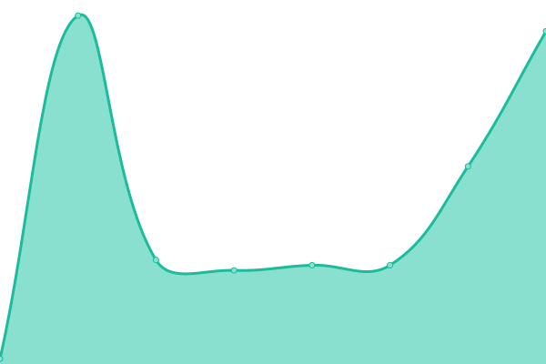
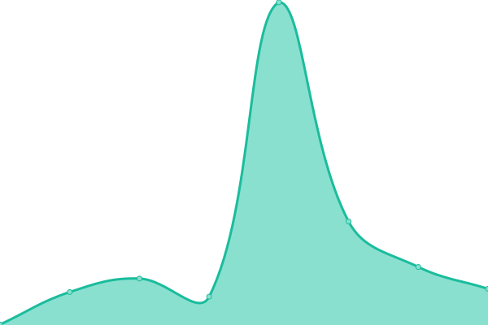

# [📈 Live Status](https://upptime.github.io/upptime): <!--live status--> **🟩 All systems operational**

This repository contains the open-source uptime monitor and status page for [Upptime](https://upptime.js.org), powered by [Upptime](https://github.com/upptime/upptime).

With [Upptime](https://upptime.js.org), you can get your own unlimited and free uptime monitor and status page, powered entirely by a GitHub repository. We use [Issues](https://github.com/upptime/upptime/issues) as incident reports, [Actions](https://github.com/cincinnatilibrary/uptime-reports/actions) as uptime monitors, and [Pages](https://upptime.github.io/upptime) for the status page.

<!--start: status pages-->
<!-- This summary is generated by Upptime (https://github.com/upptime/upptime) -->
<!-- Do not edit this manually, your changes will be overwritten -->
<!-- prettier-ignore -->
| URL | Status | History | Response Time | Uptime |
| --- | ------ | ------- | ------------- | ------ |
|  [CHPL Classic WebPAC (Public Access Catalog)](https://classic.cincinnatilibrary.org/) | 🟩 Up | [chpl-classic-web-pac-public-access-catalog.yml](https://github.com/cincinnatilibrary/uptime-reports/commits/HEAD/history/chpl-classic-web-pac-public-access-catalog.yml) | 

 376ms
     
 | 

<a href="https://cincinnatilibrary.github.io/uptime-reports/history/chpl-classic-web-pac-public-access-catalog">100.00%</a>
    

|  [CHPL Sierra REST API](https://classic.cincinnatilibrary.org/iii/sierra-api/about) | 🟩 Up | [chpl-sierra-rest-api.yml](https://github.com/cincinnatilibrary/uptime-reports/commits/HEAD/history/chpl-sierra-rest-api.yml) | 

 51ms
     
 | 

<a href="https://cincinnatilibrary.github.io/uptime-reports/history/chpl-sierra-rest-api">100.00%</a>
    

|  [CHPL Encore Discovery Layer](https://catalog.cincinnatilibrary.org) | 🟩 Up | [chpl-encore-discovery-layer.yml](https://github.com/cincinnatilibrary/uptime-reports/commits/HEAD/history/chpl-encore-discovery-layer.yml) | 

 1686ms
     
 | 

<a href="https://cincinnatilibrary.github.io/uptime-reports/history/chpl-encore-discovery-layer">100.00%</a>
    

|  [CHPL Remote Databases / EZProxy](https://login.research.cincinnatilibrary.org/login) | 🟩 Up | [chpl-remote-databases-ez-proxy.yml](https://github.com/cincinnatilibrary/uptime-reports/commits/HEAD/history/chpl-remote-databases-ez-proxy.yml) | 

 397ms
     
 | 

<a href="https://cincinnatilibrary.github.io/uptime-reports/history/chpl-remote-databases-ez-proxy">100.00%</a>
    

|  [CHPL Main Web Site / BiblioWeb](https://cincinnatilibrary.org/) | 🟩 Up | [chpl-main-web-site-biblio-web.yml](https://github.com/cincinnatilibrary/uptime-reports/commits/HEAD/history/chpl-main-web-site-biblio-web.yml) | 

 1025ms
     
 | 

<a href="https://cincinnatilibrary.github.io/uptime-reports/history/chpl-main-web-site-biblio-web">100.00%</a>
    

|  [CHPL Discovery Layer / BiblioCore](https://cincinnatilibrary.bibliocommons.com) | 🟩 Up | [chpl-discovery-layer-biblio-core.yml](https://github.com/cincinnatilibrary/uptime-reports/commits/HEAD/history/chpl-discovery-layer-biblio-core.yml) | 

 1116ms
     
 | 

<a href="https://cincinnatilibrary.github.io/uptime-reports/history/chpl-discovery-layer-biblio-core">100.00%</a>
    

|  [CHPL libcal](https://cincinnatilibrary.libcal.com/) | 🟩 Up | [chpl-libcal.yml](https://github.com/cincinnatilibrary/uptime-reports/commits/HEAD/history/chpl-libcal.yml) | 

 309ms
     
 | 

<a href="https://cincinnatilibrary.github.io/uptime-reports/history/chpl-libcal">100.00%</a>
    

|  [Collection Analysis Datasette](https://collection-analysis.cincy.pl/) | 🟩 Up | [collection-analysis-datasette.yml](https://github.com/cincinnatilibrary/uptime-reports/commits/HEAD/history/collection-analysis-datasette.yml) | 

 181ms
     
 | 

<a href="https://cincinnatilibrary.github.io/uptime-reports/history/collection-analysis-datasette">100.00%</a>
    

|  [Newsdex](http://newsdex.chpl.org/) | 🟩 Up | [newsdex.yml](https://github.com/cincinnatilibrary/uptime-reports/commits/HEAD/history/newsdex.yml) | 

 535ms
     
 | 

<a href="https://cincinnatilibrary.github.io/uptime-reports/history/newsdex">100.00%</a>
    

<!--end: status pages-->

[**Visit our status website →**](https://upptime.github.io/upptime)

## 📄 License

- Powered by: [Upptime](https://github.com/upptime/upptime)
- Code: [MIT](./LICENSE) © [Upptime](https://upptime.js.org)
- Data in the `./history` directory: [Open Database License](https://opendatacommons.org/licenses/odbl/1-0/)
